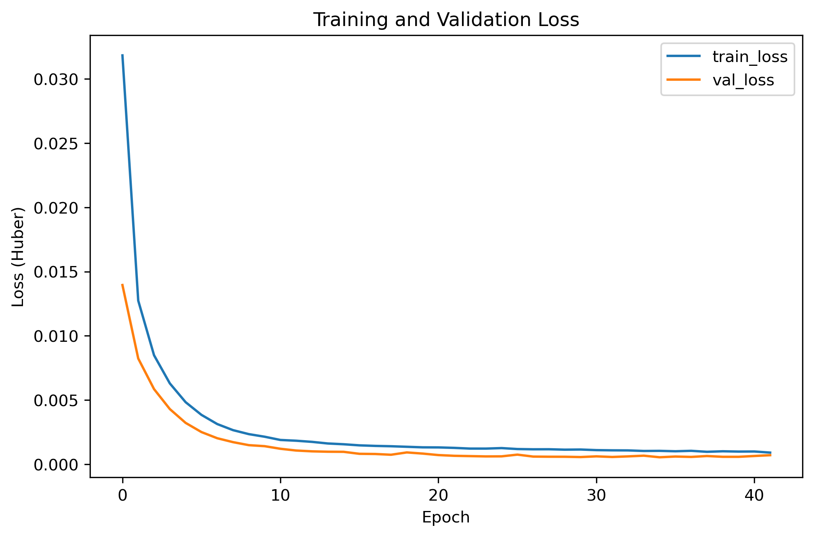
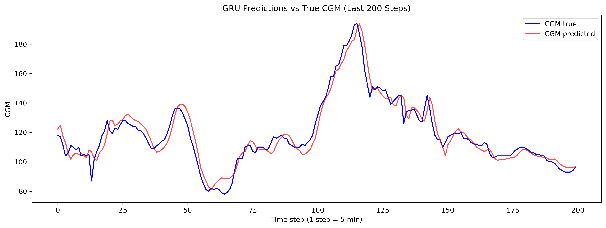
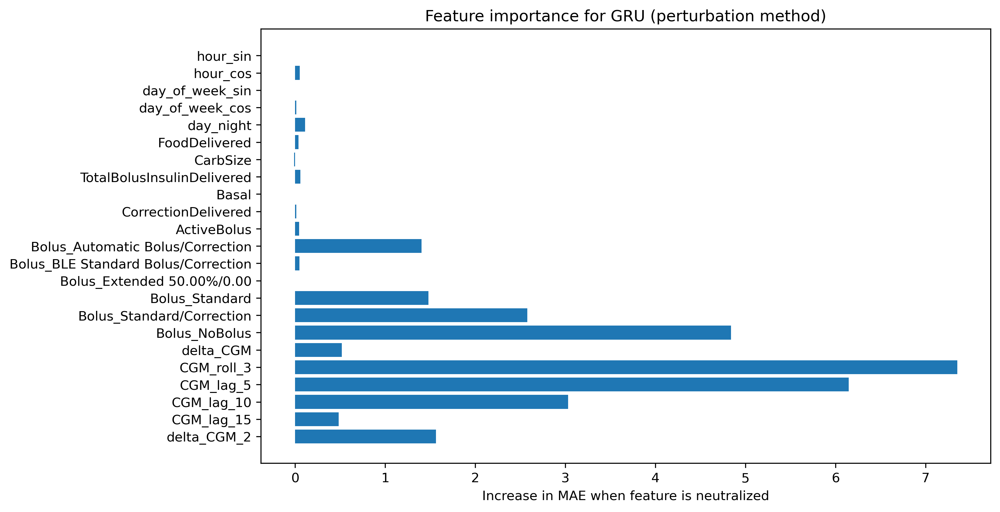

# Glucose Forecasting and Insulin Dynamics Analysis in Type 1 Diabetes

## About This Project
Managing Type 1 Diabetes is a daily challenge — your blood sugar can swing up or down quickly, and catching it in time is crucial. That’s why I wanted to build a model that could **predict glucose levels one hour ahead**. The idea is simple: give patients a little heads-up before a risky spike or drop happens. Even one hour of foresight can make a big difference.  

In this project, I use **CGM readings**, insulin delivery data (basal, bolus, corrections), carbohydrate intake, and a few engineered features that capture short-term trends. I trained the model on one patient’s data, but the setup is flexible and could be applied to others too.

## Why I Did This
I wanted something practical. Something that could actually help a patient avoid a hypoglycemic episode or a high blood sugar spike. I also wanted to learn more about **time-series modeling in healthcare**, especially using GRU networks.

## How I Approached the Problem
- **Problem type:** Supervised regression — predicting a numeric value (blood glucose) 60 minutes ahead.  
- **Input:** A rolling window of 12 time steps (1 hour), sampled every 5 minutes.  
- **Features:** Glucose readings, insulin doses, carbs, and temporal features like short-term changes and rolling averages.  
- **Data split:** 80% for training, 20% for validation, split by time to preserve the sequence.  
- **Data choice:** I started with one patient to simplify things, but the model can be applied to any patient because each patient’s data is separate.

## Model Architecture
- **Conv1D layer** (16 filters, ReLU) — captures local patterns in glucose changes.  
- **GRU layers** (32 and 16 units) — handle the sequential nature of glucose readings.  
- **Dense layers** — combine features and output a single predicted glucose value.  
- **Loss:** Huber — helps with outliers without being too harsh.  
- **Optimizer:** Adam, carefully tuned for stable training.  

## Results
On the validation set, the model performed surprisingly well:  
- **MAE:** 4.59 mg/dL  
- **RMSE:** 6.45 mg/dL  
- **MAPE:** 3.47%  

Most predictions follow the actual CGM readings closely. The largest errors occur during sudden glucose spikes or drops — which actually makes sense, because those moments are hard to predict.  

### Key Visuals
- **Training & validation loss** — shows smooth learning  
  

- **Predicted vs True CGM (last 200 steps)** — predictions track reality closely  
  

- **Top 10 prediction errors** — highlights the moments the model struggled most  
  

- **Error distribution** — most predictions are very close  
  

- **Feature importance** — recent CGM trends, short-term changes, and insulin doses were most influential  
  

I personally found it interesting that **small recent changes in CGM were more important than the absolute value itself**, which shows how sensitive blood glucose is to immediate past trends.

## Repository Structure
project/  
│  
├─ Data_Subject 1.csv               # Patient data used for training  
├─ AZT1D_Insulin_Prediction.ipynb  # Jupyter notebook with all code  
├─ best_model.h5                    # Trained model  
├─ figures/                         # PNG plots for README  
├─ requirements.txt                 # Python dependencies  
└─ README.md                        # This file  

## Future Improvements
- Train the model on multiple patients to improve generalization.  
- Explore more advanced models like **LSTM** or **Transformers**.  
- Integrate into a real-time monitoring system so patients get instant predictions.  

---
